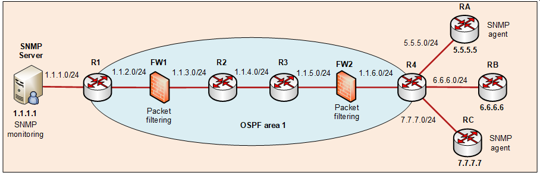

## Description of the SNMP scenario 

### Topology

### The initial configuration of the topology 
1. Perform basic router configuration.
- Configure the router hostnames and disable DNS lookup on them.
2. Configure the network interfaces and IP addressing.
- Configure IP addresses on the routers.
3. Enable SSH on routers FW1 and RA. No other access is permitted for administrators.
4. Configure OSPF routing.
- Configure OSPF routing between routers R1, R2, R3, R4, FW1 and FW2.
- Do not send routing updates towards the stub networks.
- Configure default routes on routers RA, RB and RC.
5. Configure filtering on firewalls FW1 and FW2.
- Only allow traffic from ATT monitoring server to enter FW1. No other traffic except OSPF routing is permitted.
- Only web, email and ssh services can be sent to RA. No other traffic is permitted to RA.
  
### Configuration task: description of the SNMP scenario to be configured using the LLM
> Configure the SNMP agents on routers RA, RB and RC.
> - Set the community string to "att-monitoring".
> - Restrict access to the SNMP service to the 1.1.1.1 host only. 
> - Enable traps to be sent to the monitoring server. 
> 
> Configure firewalls to enable SNMP monitoring.
> - Update the ACLs on routers FW1 and FW2 to allow SNMP communication. 

## Evaluation of the SNMP scenario 

The explanation of the metrics and details of the evaluation framework will be published at the NCA 2026 conference in November 2026. 
Here, we present a final evaluation using three scores: 
- Configuration Accuracy Score (CAS): compares a generated configuration with the reference configuration.
- Weighted Feature Coverage (WFC): measures the percentage of feature tests that successfully passed.
- Regression Preservation Rate (RPR): quantifies the proportion of scenario-level invariants that hold after the configuration update.

| Model | CAS | WFC | RPR |
| :----| :-: | :-: | :-: |
| Grok  | 89.4% | 91.7% |  100% |
| Deepseek | 74.5% | 58.3 | 100% |
| GTP 5 | 79.6% | 100% | 100% |
| GTP-OSS, run 1 | 52.0% | 58.3% | 100% |
| GTP-OSS, run 2 | 68.5% | 41.7% | 100% |
| GTP-OSS, run 3 | 61.4% | 100% | 100% |
| GTP-OSS, run 4 | 64.7% | 50% | 100% |
| GTP-OSS, run 5 | 83.2% | 66.7% | 97.8 |

### Overview of the regression tests applied
| Task   |  Regression tests |
| :------| :----|
| TBD | TBD |

### Description of the regression tests
| Regression test   |  Descrioption |
| :------| :----|
| TBD  | TBD |
